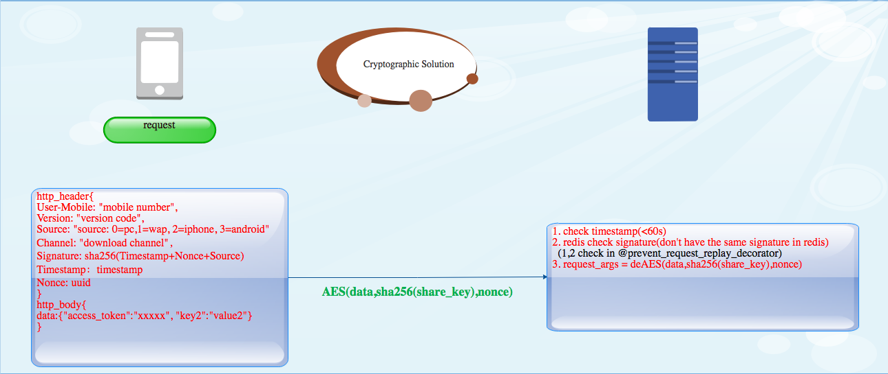

## Cryptography Solution


The security issue in network communication is what we need to face at all times. Encryption is a very common method we use in communication. ``Elliptic-curve Diffie–Hellman(ECDH)``  is an anonymous key agreement protocol that allows two parties, each having an elliptic-curve public–private key pair, to establish a shared secret over an insecure channel which using ``Elliptic-curve cryptography(ECC)`` and ``Diffie–Hellman key exchange``.

In our daily production, we often need the cooperation between the server side and the frontend (including the web side, iOS side and Android side). To transfer and store  ``password`` and ``token`` are also problems which we need to face. So the **Cryptography Solution** comes. It provide the cryptography solution for the **server side and the frontend (including the web side, iOS side and Android side)**. 


Registration and login:


Communication:



网络通信中的安全问题是我们时刻需要面对的。通信加密是我们非常常用的方法。``椭圆曲线Diffie-Hellman（ECDH）``是一种匿名密钥协商协议，允许双方（每个都具有椭圆曲线公钥 - 私钥对）在不安全的信道上建立共享秘密，使用``椭圆曲线加密（ECC）`` 和``Diffie-Hellman密钥交换``。

在我们的日常生产中，我们经常需要服务器端和前端（包括Web端，iOS端和Android端）之间的合作。 转移和存储密码和令牌也是我们需要面对的问题。 所以 **Cryptography Solution**来了。 它为**服务器端和前端（包括Web端，iOS端和Android端）提**供加密解决方案。


Team:

[Marshal Chen](https://github.com/cymcsg)

[Four](https://github.com/wjmwjmwb)

David Zhang

Wenjing

## License

``` 
Copyright 2014-present Marshal Chen

Licensed under the Apache License, Version 2.0 (the "License");
you may not use this file except in compliance with the License.
You may obtain a copy of the License at

   http://www.apache.org/licenses/LICENSE-2.0

Unless required by applicable law or agreed to in writing, software
distributed under the License is distributed on an "AS IS" BASIS,
WITHOUT WARRANTIES OR CONDITIONS OF ANY KIND, either express or implied.
See the License for the specific language governing permissions and
limitations under the License.
```